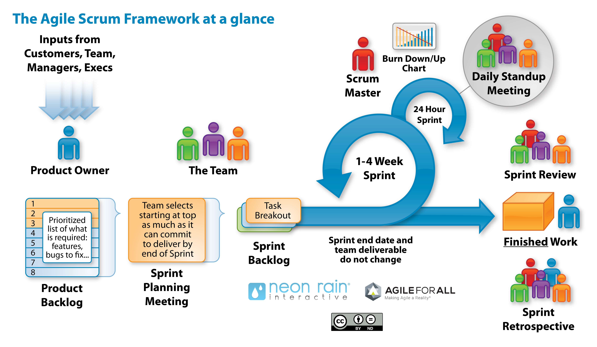

.. Copyright (C) 2019 Christopher Voltz

:title: Introduction to the Scrum Agile Framework
:author: Christopher Voltz
:description: An introduction to the Scrum agile framework for STHS.
:keywords: presentation, scrum
:skip-help: true

.. |--| unicode:: U+2013 .. en dash

.. |---| unicode:: U+2014 .. em dash, trimming surrounding characters
  :trim:

.. |br| raw:: HTML

   

.. |clear| raw:: HTML

  

----

:id: title
:data-x: 0
:data-y: 0
:data-z: 0
:data-rotate: 0

Introduction to the Scrum Agile Framework
=========================================

`Christopher Voltz <https://www.linkedin.com/in/christopher-voltz/>`_ |br|
Master Engineer |br|
Hewlett Packard Enterprise |br|

September 16, 2019

.. note::

  Good morning gentleman. I'm a master engineer at Hewlett Packard Enterprise in
  the high performance computing storage group.  I've been using the scrum agile
  framework for many years to develop software so Mrs. Warnes asked me to come
  and explain how you can use it when developing your software.

----

:id: presentation
:data-x: r2000

Presentation
============

This presentation is available on my website at:
https://voltz.ws/sths/scrum

The source for the presentation is available on GitHub at:
https://github.com/cvoltz/scrum

Hyperlinks are not underlined but show up in blue. If you hover over a
hyperlink, it will be underlined.

.. note::

  Just a quick side note. This presentation is available on my website and the
  source is available on GitHub.

  Note that while I show the URL here, in most of the presentation, when
  items are hyperlinked, the URL isn't shown. The link is displayed in blue and
  when your cursor hovers over it, the link will become underlined.

----

:id: process
:data-x: 0
:data-y: 1100

.. note::

  This is an overview of the entire Scrum framework. Scrum is a lightweight,
  iterative, and incremental framework for managing complex work. It does not
  follow the traditional sequential approach of the waterfall model Mrs. Warnes
  explained to you last week. It attempts to resolve the issues with the
  waterfall development model by recognizing that customers change their mind
  about about what they want or need and that there will be unpredictable
  challenges during development. While we talking about scrum in the context of
  software development, scrum can (and is) used outside of software development.
  Also, scrum is only one of many agile frameworks but it is one of the most
  popular.

  The people shown in the diagram represent the different roles in scrum.

----

:id: roles
:data-x: r2000
:data-y: r0

Scrum Roles
===========

* **Product Owner**: Represents the business stakeholders.

  * Adds items to the product backlog.
  * Prioritizes the product backlog.

* **Scrum Master**: Servant-leader.

  * Removes impediments.
  * Facilitates team events.
  * Buffer between the team and distracting influences.
  * Coaches team on Scrum practices.

* **Development Team**: People who carry out the tasks to build increments of
  value.

  * Not just programmers |---| architects, UI/UX designers, testers, etc.
  * Self organizing.

.. note::

  The product owner is the person who represents the business which needs the
  software. He or she is responsible for working with the business people to
  determine things like funding, schedule, and priorities and communicates the
  scrum team's status to management. The product owner is the one responsible
  for maintaining the product backlog. The product backlog is a prioritized list
  of work to be done and is the list of product requirements.

  The scrum master is a person who helps the scrum team to complete their work
  and follow the scrum process. The scrum master is not a manager in charge of
  the development team but a leader who is a servant to the team. The scrum
  master role is usually handled by a program or project manager who has been
  certified in the scrum process. Their job is to remove impediments (things
  that are preventing the team from completing their work). They also
  schedule the various team events like the sprint planning meeting, daily
  standup meetings, sprint demo, and sprint retrospective.

  The development team are the people who actually do the tasks required to
  create increments of functionality which add value to the product. An
  important thing to note is that the development team is not just the
  programmers on the team but it includes architects (who design the structure
  of the software), the UI/UX designers (who design the user interface and user
  experience of the software), testers, and others who contribute to the
  product.

----

:id: process2
:data-x: r2000
:data-y: r0

.. note::

  At the beginning of the project, the scrum master will work with the product
  owner to create the product backlog and will work with the development team to
  provide an estimate, in story points, of the complexity of each item (called a
  story) in the product backlog so the product owner will be able to better
  prioritize the stories. The development team uses a process called planning
  poker to come up with an estimate that everyone in the team agrees with. Story
  point values can be selected in many ways but a Fibonacci sequence is commonly
  used (so values like 1, 2, 3, 5, 8, and 13 are commonly used). Usually larger
  numbers are indications that the feature is too complex and needs to be broken
  down into smaller features.

  One of the key features of scrum is that work is done in small increments of
  time called a sprint. The actual length of time used for the sprint varies
  based on the type of software being developed and the industry it is in.
  An e-commerce site might have weekly sprints while safety critical software
  may have sprints which last months. Longer sprints are less desirable since
  they increase the time for feedback which allows the team to ensure they are
  building the software the business needs. The idea is that at the end of each
  sprint, the team will have written and tested some new functionality to the
  product.

  At the start of a sprint, the product owner, the scrum master, and the
  development team will meet in a sprint planning meeting. In that meeting, the
  development team will pull features from the top of the product backlog into
  the sprint backlog and decompose them into small units of work called tasks
  which can be completed within the sprint. The development team will estimate
  the amount of hours it will take to complete a task and will continue to pull
  items off the product backlog so long as they believe they can get the work
  done within the sprint. This is the time for the development team to ask the
  product owner any questions necessary to ensure they understand what is
  required to complete a story.

  Once the sprint starts, members in the development team will work on tasks
  they are capable of completing. The individuals in the team decide which tasks
  they want to work on. The scrum master and the product owner don't have any
  say in this. Each day, the entire teams meets together in standup meeting,
  which is a short meeting (usually less than 15 minutes) where everyone is
  standing and, one by one, each of the developers indicates what they did
  yesterday, what they plan to do today, and if they have any impediments (i.e.,
  things preventing them from being able to work). The scrum master records all
  of the impediments so he or she can work to resolve them, outside of the
  meeting. Selecting who goes first is often done by who shows up in the room
  last. Note that it is important that the meeting starts on time each day.
  Sometimes, there are penalties for being late. It depends on the team. The
  idea of the standup meeting is for the product owner to get a status update on
  how the sprint is progressing, let the scrum master know of any impediments
  that are slowing the sprint down, allow engineers to know if someone needs
  help with a task, and to provide some accountability to your peers.

  When all of the tasks for a given story are completed, the development team
  will mark the story as completed. Tasks for a story should include writing
  unit and acceptance tests to ensure the feature is working properly. Teams
  may work multiple stories in parallel or may work on all of the tasks for a
  single story in parallel. It is up to the team. The burn down or burn up chart
  shows the progress of the development team in completing tasks and stories.
  The chart is usually updated in real-time and made publicly available so
  everyone can see how the sprint is going.

  At the end of the sprint, the development team demonstrates the new
  functionality to the product owner in a sprint review. The product owner will
  accept any stories which they agree are finished and will reject any stories
  which they do not agree are finished. This is one of the reasons it is
  important to agree in the sprint planning meeting on what done means for a
  story. Rejected stories go back onto the product backlog. While a sprint
  should finish all stories on the sprint backlog, it sometimes happens, for
  various reasons, that not all stories are completed. Such a sprint is called
  a failed sprint.

  It is important to note that the product owner can decide to release the
  software after the sprint is completed or they can decide to wait until more
  functionality has been added in future sprints. Completed stories should
  always be production ready.

  After the sprint review, the team gets together in a sprint retrospective and
  discusses what went well during the sprint, what didn't go well, and what the
  plans are to try and improve the process. Typically there are 3 items of each
  but there is no prescribed number. The important thing here is to continually
  be improving the process so future sprints will go better. Example items to
  improve can be things like training for the team on a tool or technology or
  getting equipment that is needed to improve productivity.

  The sprint cycle then repeats itself.

  Note that during a sprint, the product owner and scrum master should be
  working on adding new items to the backlog and reprioritizing items. When new
  stories are added, the development team needs to do the planning poker to
  estimate the complexity of the story.

----

:id: links
:data-x: r2000
:data-y: r0

Links
=====

* `What is Scrum <https://www.atlassian.com/agile/scrum>`_
* `Kunagi <http://kunagi.org/>`_

  * `Dashboard <http://kunagi.org/screenshots/dashboard.png>`_
  * `Product backlog <http://kunagi.org/screenshots/productbacklog.png>`_
  * `Sprint Whiteboard <http://kunagi.org/screenshots/whiteboard.png>`_

.. note::

  Here are some useful links. The first one is a good description of scrum. The 
  second is the tool I use for managing our sprints. It is open source so you
  should be able to use it.  Here are some snapshots of what it looks like.

----

:id: manifesto
:data-x: 0
:data-y: r1100

Manifesto for Agile Software Development
========================================

We are uncovering better ways of developing software by doing it and helping
others do it.  Through this work we have come to value:

**Individuals and interactions** over processes and tools |br|
**Working software** over comprehensive documentation |br|
**Customer collaboration** over contract negotiation |br|
**Responding to change** over following a plan |br|

That is, while there is value in the items on the right, we value the items on
the left more.

=================  ==============  ================
Kent Beck          James Grenning  Robert C. Martin
Mike Beedle        Jim Highsmith   Steve Mellor
Arie van Bennekum  Andrew Hunt     Ken Schwaber
Alistair Cockburn  Ron Jeffries    Jeff Sutherland
Ward Cunningham    Jon Kern        Dave Thomas
Martin Fowler      Brian Marick
=================  ==============  ================

© 2001, the above authors this declaration may be freely copied in any form,
but only in its entirety through this notice. |br|
https://agilemanifesto.org/

.. note::

  Unfortunately, we don't have the time to go over the agile manifesto or the
  principles behind the agile manifesto but I have included slides on both
  topics that you can read at your leisure. The important thing to note is how
  each item in the agile manifesto was created to address a specific issue with
  the waterfall model which resulted in delays in releasing quality software.
  The principles behind the agile manifesto go into more detail about how to
  achieve the goals of the agile manifesto and why the principle exists.

  Thank you for your attention. Any questions?

----

:id: principles1
:data-x: r2000
:data-y: r0

Principles behind the Agile Manifesto
=====================================

Our highest priority is to satisfy the customer through early and continuous
delivery of valuable software.

Welcome changing requirements, even late in development. Agile processes
harness change for the customer's competitive advantage.

Deliver working software frequently, from a couple of weeks to a couple of
months, with a preference to the shorter timescale.

Business people and developers must work together daily throughout the project.

----

:id: principles2

Principles behind the Agile Manifesto
=====================================

Build projects around motivated individuals.  Give them the environment and
support they need, and trust them to get the job done.

The most efficient and effective method of conveying information to and within
a development team is face-to-face conversation.

Working software is the primary measure of progress.

Agile processes promote sustainable development.  The sponsors, developers, and
users should be able to maintain a constant pace indefinitely.

----

:id: principles3

Principles behind the Agile Manifesto
=====================================

Continuous attention to technical excellence and good design enhances agility.

Simplicity--the art of maximizing the amount of work not done--is essential.

The best architectures, requirements, and designs emerge from self-organizing
teams.

At regular intervals, the team reflects on how to become more effective, then
tunes and adjusts its behavior accordingly.

----

:id: hovercraft
:data-x: 0
:data-y: r1100

Hovercraft
==========

The tool I used to create my presentation is called Hovercraft_. A presentation
on Hovercraft is available here_.  Hit the space-bar or right arrow to advance
to the next slide. You can press ``h`` to bring up the help menu. Press ``p``
to display the presenter popup which shows the presenter notes.

Hovercraft is a combination of reStructuredText_, impress.js_, and
impressConsole.js_, with some positioning enhancements. Hovercraft
documentation is available here_. reStructuredText is a plaintext markup
language which generates HTML (and LaTex, and man-pages, and XML). It is part
of Docutils_. With Hovercraft, one can generate an HTML presentation with just
some simple markup text.

.. _Hovercraft: https://github.com/regebro/hovercraft
.. _here: http://regebro.github.io/hovercraft/#/step-1
.. _reStructuredText: http://docutils.sourceforge.net/rst.html
.. _impress.js: http://github.com/bartaz/impress.js
.. _impressConsole.js: https://github.com/regebro/impress-console
.. _DocUtils: http://docutils.sourceforge.net

----

:id: toc
:data-x: 3000
:data-y: 2000
:data-z: -1
:data-rotate: 0
:data-scale: 5
